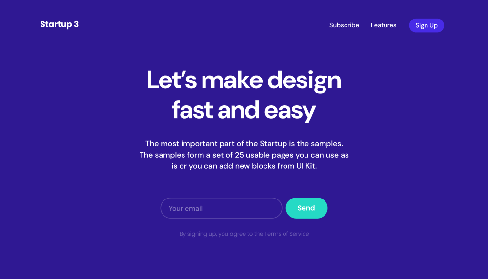
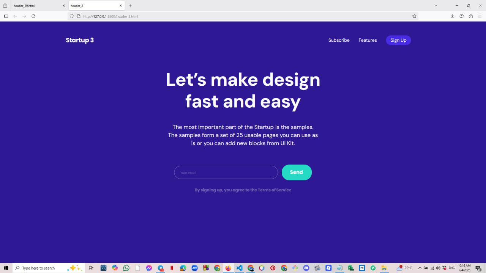
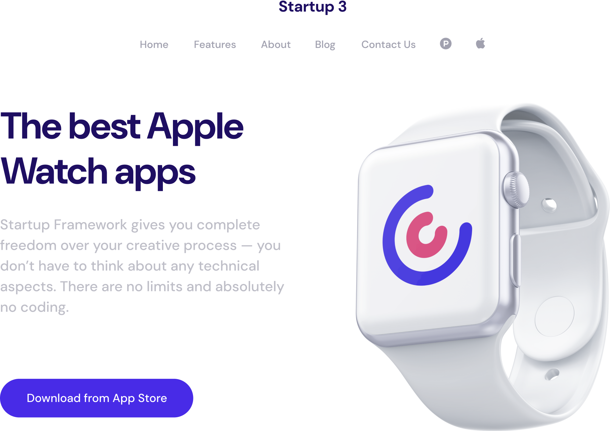
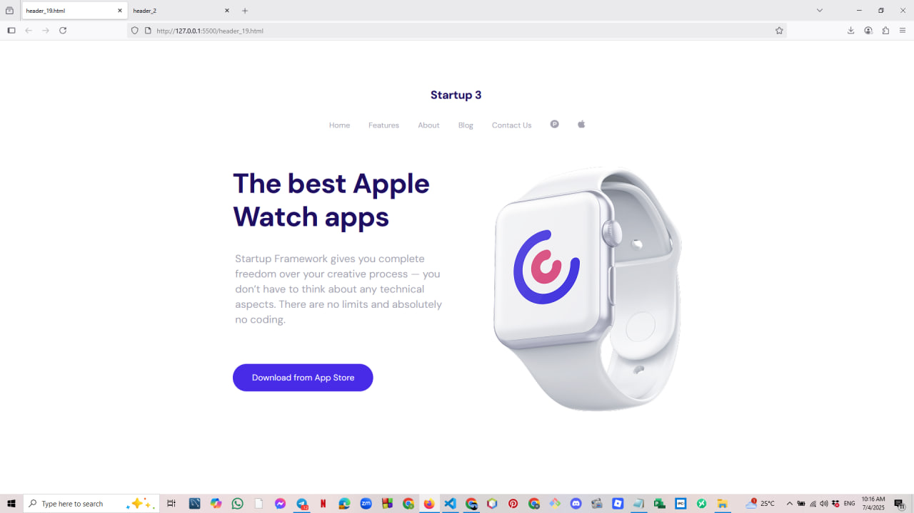

# UI Header Components Project

This project showcases two responsive header components designed using HTML5 and CSS3. It demonstrates how to build modern landing page headers with clean structure, layout, and typography inspired by the "Startup 3" design style.

## 📁 Folder Structure

📦 Figma_UI_Task2/
├── header_19.html
├── header_2.html
├── css/
│   ├── header_19.css
│   └── header_2.css
├── assets/
│   ├── apple_icon.png
│   ├── pinterest_icon.png
│   └── clock_header_19.png
├── reference/
│   ├── header_2_reference.png
│   └── header_19_reference.png
├── result/
│   ├── header_2_result.png
│   └── header_19_result.png

## 🧩 Components

### 1. `header_19.html`
- Features a navigation bar with social icons.
- Contains a content section promoting Apple Watch apps.
- Uses the `DM Sans` font via Google Fonts.
- Layout includes text and image side by side.

### 2. `header_2.html`
- Focuses on newsletter sign-up and CTA.
- Uses both `DM Sans` and `Poppins` fonts.
- Includes a responsive form with email input and send button.
- Clean and modern structure.

## 🎨 Technologies Used
- HTML5
- CSS3
- Google Fonts
- Basic responsive layout practices

## 🧪 How to Run
Simply open the HTML files in any modern browser:
- `header_19.html`
- `header_2.html`

## 📸 Screenshots Comparison

### 🔹 Header 2

**Figma Reference:**

**My Result:**

---

### 🔹 Header 19

**Figma Reference:**

**My Result:**

